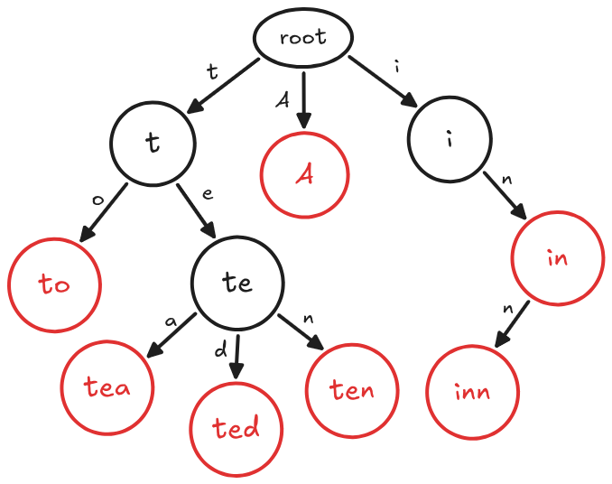
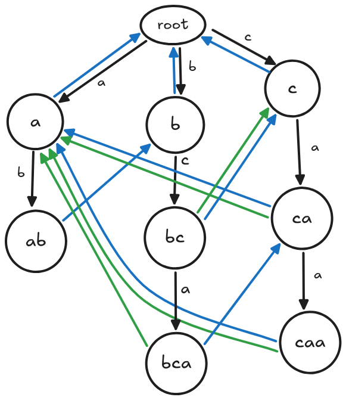
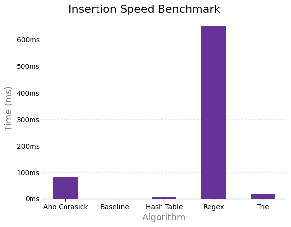
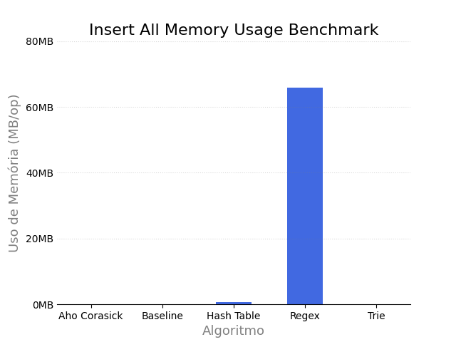
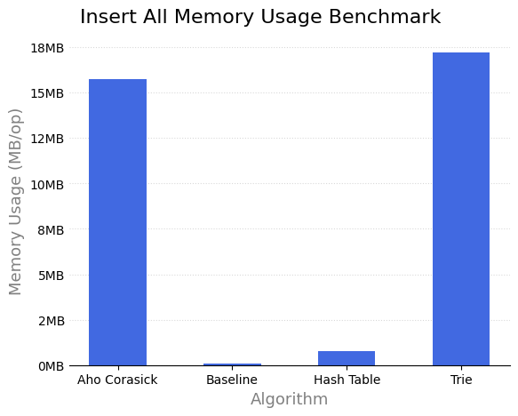
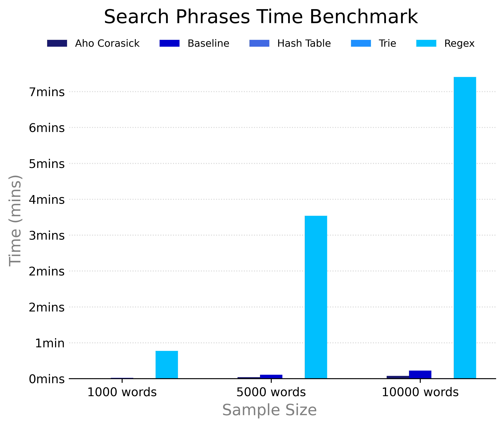
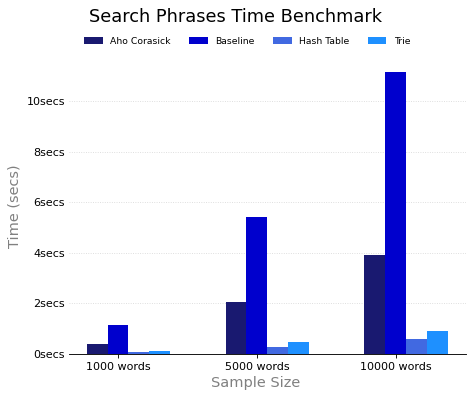

# Estratégias de Filtragem de palavras ofensivas

Implementação, documentação e comparação da Trie e outros métodos para a filtragem de palavras ofensivas.

## Sumário

- [Estrutura de diretórios](#estrutura-de-diretórios)

- [Introdução](#introdução)

- [Objetivo](#objetivo)

- [Estruturas e Algoritmos](#estruturas-e-algoritmos)

- [Como rodar o experimento?](#como-rodar-o-experimento)

- [Metodologia](#metodologia)

- [Experimentos](#experimentos)

- [Considerações Finais](#considerações-finais)

- [Ameaças à validade](#ameaças-à-validade)

- [Trabalhos Futuros](#trabalhos-futuros)

- [Contribuintes](#contribuintes)

---

### Versionamento de código

O versionamento do projeto foi feito utilizando [Git](https://git-scm.com/) (por meio da plataforma [Github](https://docs.github.com/pt)), permitindo o controle das alterações ao longo do projeto. Foram criadas branches para organizar melhor o fluxo de desenvolvimento e isolar as alterações. Além disso, como regra, permitimos apenas que a branch `main` fosse alterada por meio de pull requests, que deveriam obrigatoriamente ser revisadas por um membro da equipe, garantindo a integração organizada das modificações ao repositório principal.

Dessa forma, foi possível garantir que todos os integrantes do projeto estivessem cientes das alterações que foram introduzidas. Foi criada também uma restrição que pull requests seriam apenas aceitas com a opção de `Squash and Merge`, que possibilita um histórico mais limpo de commits, de forma que seja mais fácil notas a contribuição para o repositório.

### Comparação entre os métodos de filtragem

A comparação entre os métodos de filtragem foi feita utilizando a biblioteca [JMH](https://openjdk.org/projects/code-tools/jmh/) (Java Microbenchmark Harness), uma biblioteca poderosa oficial da [OpenJDK](https://openjdk.org/), utilizada para criar, executar e analisar microbenchmarks em linguagens que utilizam a máquina virtual de java (JVM). Para esse projeto, utilizamos ela para comparar diferentes métricas das estruturas/algoritmos implementados na linguagem Java.

### Geração de inputs

A geração das cargas de dados foi feita através da linguagem de programação [Python](https://www.python.org/about/), escolhida por sua simplicidade, legibilidade e alto nível de abstração. Foram desenvolvidos scripts específicos para a criação de cenários distintos de testes (especificado mais à diante) e para formatação dos dados de entrada, permitindo a simulação de entradas com diferentes comportamentos.

### Geração de gráficos

A geração dos gráficos foi realizada a partir dos dados experimentais armazenados em arquivos `.csv`, os quais continham os resultados obtidos durante a execução dos diferentes testes. Para a visualização e análise desses dados, utilizou-se a biblioteca [Matplotlib](https://matplotlib.org/) da linguagem Python, que permitiu a construção de gráficos que representassem o comportamento e o desempenho dos métodos avaliados.

## Estrutura de Diretórios

O código do projeto foi organizado da seguinte maneira:

```
/
├───scripts
│    └───python
│       ├────generate
│       └────plot
├───src
│   └───main
│       └───java
│           ├───aho_corasick
│           ├───baseline
│           ├───hash_table
│           ├───regex
│           ├───trie
│           └───util
└───run-benchmark.sh
```

O diretório `scripts` contém scripts escritos na linguagem Python utilizados para gerar entradas (contidos no subdiretório `generate`) e plotar os gráficos relevantes aos experimentos (reúnidos no subdiretório `plot`)

Já o diretório `src` contém a implementação em Java dos métodos de filtragem escolhidos, nomeadamente: **Aho-Corasick**, **HashTable**, **Regex**, **Trie**, além de conter o baseline, a implementação "ingênua", que serve como ponto de referência base para os outros métodos.

O arquivo `run-benchmark.sh` foi utilizado para rodar o projeto de maneira simples. Ele é responsável por criar os diretórios necessários e fazer o pré-processamento necessário para rodar as comparações.

## Introdução

### Problemática

A existência de um filtro de palavras ofensivas é muito importante para plataformas digitais que almejam ser seguras. Filtros desse tipo são utilizados nos mais diversos ambientes digitais como redes sociais, fóruns, jogos online e plataformas de comunicação. É o uso dessa ferramenta que torna possível a prevenção de discursos de ódio, moderação e cumprimento de políticas, e proteção de usuários vulneráveis como crianças e adolescentes, por exemplo.

Porém, mesmo com a grande relevância dessa ferramenta, ainda não existe um meio definitivo para fazer essa filtragem, já que existem múltiplas estratégias e múltiplas maneiras de aplicar cada uma delas. Essas estratégias podem ser divididas em dois tipos diferentes, citados abaixo:

- **Uso de blacklists**: estratégias desse tipo envolvem a criação de listas de palavras banidas. Geralmente, são usadas em conjunto com algoritmos/estruturas especializados na busca e recuperação rápida de informação em strings, como **Regex**, **Aho-Corasick** e **Trie**, ou estruturas de busca rápida de propósito geral, como **HashTable**;

- **Análise Contextual**: métodos relacionados a essa estratégia estão geralmente relacionados à algoritmos de PLN (Processamento de Linguagem Natural) ou de classificação, como o [Classificador de Naive Bayes](https://en.wikipedia.org/wiki/Naive_Bayes_classifier), que conseguem detectar padrões nas frases e classificá-las de acordo.

---

### Escopo

A filtragem de palavras ofensivas é um tema bem complexo com muitos assuntos que podem se ramificar em diversos projetos diferentes. Por isso, nós tivemos o cuidado de definir bem o escopo desse projeto de antemão, de forma que fosse possível discutir e analisar de maneira completa o tema proposto por uma das vias.

Dessa forma, tendo essa problemática em mente e considerando que a estrutura base de análise desse projeto inicialmente escolhido era a **Trie**, decidimos focar nos métodos relacionados ao uso de blacklists para realizar essa filtragem, logo, nosso projeto discutirá os seguintes métodos: **Aho-Corasick**, **HashTable**, **Trie** e **Regex**.

Para realizar a análise desses métodos, nós definimos duas restrições para os nossos testes:

- **Palavras diferentes estarão separadas**: Para evitar problemas como o de [Scunthorpe](https://en.wikipedia.org/wiki/Scunthorpe_problem), que dificultariam a realização de análises estatísticas, nós evitamos trabalhar com a detecção de palavras ofensivas que estejam coladas à outras. Porém, iremos fazer testes para comparar se algum método, da maneira que foi implementado, sofreria desse problema;

- **A String recebida não pode ser processada**: Para comparar puramente a capacidade das diferentes estruturas/algoritmos, optamos por adicionar a restrição que não podemos fazer um pré-processamento na palavra/frase que estará sendo analisada, ou seja, não é permitido normalizar a palavra (substituir caracteres unicode por seus equivalentes ascii) ou mudar sua capitalização.

## Objetivo

Nesse contexto, o propósito do seguinte projeto é analisar e comparar diferentes implementações para filtragem de palavras ofensivas que se baseiam no uso de blacklists para categorizar palavras como `bad` ou `good` words. O estudo tem como objetivo analisar qual abordagem se mostra mais eficaz para identificar palavras ofensivas no meio de frases geradas pseudo-aleatoriamente livres de contexto e gírias, de maneira que seja possível analisar friamente os dados do experimento.

O tema discutido vem se tornando cada vez mais relevante nos dias atuais, visto que diversos estados e até mesmo países iniciaram a instauração de leis relacionadas à obrigatoriedade da verificação de idade na internet, a exemplo da [Califórnia](https://leginfo.legislature.ca.gov/faces/billTextClient.xhtml?bill_id=202520260AB1043), [Brasil](https://g1.globo.com/tecnologia/noticia/2025/12/11/eca-digital-protecao-criancas-adolescentes-internet.ghtml) e [Inglaterra](https://en.wikipedia.org/wiki/Online_age_verification_in_the_United_Kingdom), com a justificativa de proteger crianças e adolescentes nos ambientes digitais, proibindo que conteúdos considerados inadequados sejam exibidos para eles, algo que está muito ligado à moderação de conteúdo através da filtragem de palavras ofensivas.

## Estruturas e Algoritmos

### Baseline

O Baseline (ou implementação "ingênua") representa a abordagem mais simples e direta possível para a resolução do problema de filtragem de palavras. Ele serve como uma linha de base, um ponto de referência para avaliar se o custo de desenvolvimento e o consumo de recursos de estruturas mais complexas (como as outras estruturas e implementações) realmente se justificam frente aos resultados obtidos.

#### Funcionamento do Algoritmo

A implementação desenvolvida para o Baseline não utiliza estruturas de dados avançadas para buscas de texto, baseando-se apenas em um array simples de strings (String[]) para armazenar a lista negra (blacklist) de palavras ofensivas. O verificação funciona da seguinte maneira:

1. **Separação da frase (Tokenização)**: Quando a função hasBadWord recebe uma frase, ela a divide em um array de palavras independentes.

2. **Busca Linear (Linear Search)**: O algoritmo itera sobre cada palavra da frase tokenizada e, para cada uma delas, invoca o método isBadWord. Este método percorre sequencialmente todo o array de palavras ofensivas, realizando uma comparação através do método .equals(). E ao final, retorna a quantidade de palavras que são consideradas `bad` (estão presentes na blacklist).

#### Análise e Contextualização

Este método é considerado "ingênuo" principalmente devido à sua ineficiência durante a busca. Para uma frase contendo N palavras e uma blacklist com M palavras ofensivas, a complexidade computacional seria de O(n · m) verificando cada palavra com toda a blacklist.

Além disso, o Baseline se torna altamente suscetível a falsos negativos. Ele é incapaz de detectar variações triviais de uma ofensa (como diferenças de capitalização ou o uso de caracteres da tabela L33T), a menos que cada uma dessas variações seja explicitamente adicionada na blacklist.

Apesar dessas fraquezas evidentes na capacidade de detecção e velocidade em entradas grandes, o Baseline deve apresentar um consumo de memória extremamente baixo, servindo como um limite inferior para os experimentos propostos.

---

### HashTable

A HashTable introduz uma melhoria significativa na etapa de busca de palavras em relação ao Baseline. No contexto do projeto, foi utilizada a implementação HashSet da biblioteca padrão do Java. Essa estrutura se destaca por oferecer uma complexidade de tempo média constante para inserções e buscas rápidas.

#### Funcionamento do Algoritmo

A implementação da HashTable para este filtro foca na velocidade de verificação das palavras contidas na blacklist. O fluxo ocorre da seguinte maneira:

1. **Inicialização e Armazenamento**: Durante a instanciação da classe HashTable, o construtor recebe um array contendo as palavras ofensivas. O algoritmo inicializa um `HashSet<String>` e insere todas as palavras do array.

2. **Separação da frase (Tokenização)**: O método countBadWords recebe uma frase completa e a divide em um array de strings individuais.

3. **Busca e contagem de ocorrências**: O algoritmo itera sobre cada palavra da frase e utiliza o método .contains() do HashSet para verificar sua presença na blacklist. O Java calcula o hash da palavra e busca diretamente no endereçamento da memória, evitando a necessidade de percorrer a blacklist inteira. Se a palavra for ofensiva, uma variável de contagem é incrementada e seu valor final é retornado.

#### Análise e Contextualização

A principal vantagem da HashTable deverá ser evidenciada no teste de "Velocidade para entradas grandes". Enquanto o Baseline possui uma desvantagem ao verificar elemento por elemento, a HashTable manterá um desempenho de verificação extremamente rápido, sendo pouco impactada pelo crescimento do tamanho da blacklist.

Apesar da velocidade superior de busca, a estrutura traz trade-offs importantes que serão explorados nos demais testes:

- **Consumo de Memória**: É esperado que a HashTable apresente um custo de memória notavelmente maior que o Baseline. Isso acontece porque a estrutura exige mais memória para organizar suas tabelas internas e para gerenciar as colisões de dados.

- **Capacidade de Detecção Limitada**: Assim como o Baseline, a HashTable é severamente afetada pela restrição de que a String recebida deve ser idêntica à badword contida no HashMap.

---

### Regex

Regex é um autômato finito determinístico utilizado comumente na busca de palavras em arquivos que, no contexto do projeto, representa mais uma alternativa para comparação na filtragem das palavras. O algoritmo se destaca ao utilizar um padrão construído numa string seguindo suas próprias regras de codificação e formatação para identificar as palavras-alvo.

#### Funcionamento do Algoritmo

A montagem do padrão Regex implementada no projeto visa identificar tanto palavras normais quanto modificadas, sejam elas codificadas com leetcodes, espaçadas, esticadas, etc.

1. **Inicialização e Armazenamento**: Na inicialização do Regex, o construtor recebe um array de palavras e uma tabela de leets. Então, o algoritmo monta o padrão Regex a partir da concatenação de grupos de captura contendo todas as variacoes leet para cada letra de cada palavra. Após isso, o algoritmo compila esse padrão e armazena na classe.

2. **Separação da frase (Tokenização)**: O método recebe uma frase inteira e repassa para o método matcher() da classe Pattern, que cria um objeto Matcher que pode realizar operações de match na frase passada.

3: **Busca e contagem de ocorrências**: Utiliza-se o metodo .find() da classe Matcher para iterar sobre cada ocorrência de badword identificado pelo Matcher a partir do padrão passado no construtor do algoritmo. Então, para cada grupo encontrado, incrementa uma variavel de contagem que é retornada ao fim do método.

#### Análise e Contextualização

Ao analisar os resultados dos testes de desempenho efetuados, nota-se alguns pontos positivos com relaçao ao Regex:

- **Flexibilidade**: Nos testes de frases extensas, o regex apresentou desempenho razoável para todos os tipos de modificadores, sendo um algoritmo relativamente versátil na identificação de palavras num contexto que simula o real.

- **Ótimo Desempenho em Casos Menores**: Nos testes de identificação de palavras individuais, o algoritmo desempenhou com excelência, apresentando precisão de mais de 90% para todos os testes de todos os modificadores, sendo um algoritmo confiável para entradas menores.

Dessa forma, é notório que o diferencial do Regex está na sua flexibilidade em identificar tanto palavras normais quanto palavras completamente modificadas, seja em entradas grandes ou pequenas. Entretanto, essa flexibilidade só é possível com a introdução de alguns pontos negativos:

- **Consumo de Memória**: Como, para cada letra de cada palavra, o algoritmo concatena todas as variações leet de cada uma das letras, para uma entrada de quase 1000 palavras, o algoritmo ocupa uma memória surpreendentemente superior a de todas as outras estruturas, sendo o algoritmo com o pior desempenho de memória dos testes.

- **Tempo de Execução**: De forma análoga, como o algoritmo itera sobre cada letra individualmente, identificando modificações leet de cada letra, repetições de cada letra, espaçamento, etc, o algoritmo possui um tempo de execução múltiplas vezes pior que as outras estruturas analisadas, ficando, novamente, atrás em desempenho nos testes.

---

### Trie

A Trie (também conhecida como Árvore de Prefixos) introduz uma abordagem fundamentalmente diferente e mais sofisticada para a busca de palavras em relação aos métodos de Baseline e HashTable. Essa abordagem se destaca por otimizar o armazenamento de palavras com prefixos em comum e por habilitar buscas complexas e tolerantes a variações textuais de forma eficiente.

<figure align="center">
  
  <figcaption>Figura 1: <i>Visualização de uma Trie</i></figcaption>
</figure>

Conforme pode ser observado pela figura, a conexão de um nó para seus filhos é feita por meio de caracteres. Os nós "terminais" estão representados em vermelho e representam o fim de uma das chaves inseridas previamente, mas não necessariamente indicam o fim de um caminho, como pode ser visto no caminho à direita da figura (i ↦ n ↦ n).

#### Funcionamento do Algoritmo

**Inicialização e Armazenamento**: Durante a instanciação, a Trie constrói a árvore inserindo caractere por caractere das palavras da blacklist. Cada Node armazena um HashMap de seus nós filhos, além de marcadores booleanos (end e isBadNode). O construtor recebe um mapa de dicionário (leetMap), que guarda a relação código leet para char. Adicionalmente, a implementação permite sinalizar nós intermediários como ofensivos

**Processamento de Ruídos e Evasões**: Ao contrário de estruturas de busca rígidas, a travessia na Trie implementada ignora ativamente caracteres de ofuscação, como o hífen. Quando o algoritmo encontra esse caractere no método findLongestBadWordIndex, a leitura da frase é avançada sem alterar o estado da busca.

**Busca Dinâmica com LeetMap**: O algoritmo não busca o caractere exato digitado na árvore de forma determinística. Ele consulta o leetMap para obter uma lista de possibilidades. Por exemplo, se o usuário digita '@', o mapa sugere verificar o caminho 'a'. O algoritmo explora esses caminhos alternativos dinamicamente através de chamadas recursivas.

**Contagem e Maximização de Ocorrências**: O método countBadWords itera sobre a frase e utiliza uma busca em profundidade para encontrar a maior correspondência possível a partir do índice atual. Ao encontrar uma ofensa validada por um nó terminal (end) ou raiz bloqueada (isBadNode), uma variável de contagem é incrementada e o ponteiro de leitura da frase principal salta o tamanho da palavra encontrada, evitando a contagem duplicada de fragmentos sobrepostos.

#### Análise e Contextualização

A principal vantagem da Trie implementada deverá ser evidenciada nos testes de "Eficácia de Detecção" e "Busca com Ofuscação". Enquanto a HashTable e o Baseline possuem uma restrição severa de que a palavra recebida deve ser idêntica à cadastrada, a Trie manterá uma alta taxa de acerto devido à sua integração com o leetMap e sua capacidade de lidar com delimitadores. Ela resolve o problema da ofuscação de forma nativa, sem a necessidade de superlotar a blacklist com todas as variações possíveis de uma mesma ofensa.

Apesar da capacidade de detecção vastamente superior, a estrutura traz trade-offs importantes que impactarão os resultados de performance:

**Consumo de Memória**: É esperado que a Trie apresente um custo de memória considerável. Embora economize espaço ao compartilhar prefixos (como as letras iniciais de "mal" e "maldade"), cada letra individual exige a alocação de um objeto Node, que por sua vez inicializa seu próprio HashMap interno de filhos. Esse aninhamento gera um overhead significativo de referências na memória em comparação a um HashSet de Strings inteiras.

**Complexidade e Tempo de Execução**: A complexidade de tempo de busca pura teórica em uma Trie é O(M), onde M é o tamanho da palavra buscada. Contudo, devido à funcionalidade adaptativa de Leet Speak e à busca recursiva que explora múltiplas possibilidades de caracteres simultaneamente, o tempo de execução no pior cenário será levemente superior à verificação matemática de O(1) da HashTable. Ainda assim, é um custo de processamento justificado e necessário para se obter uma moderação de texto precisa.

---

### Aho-Corasick

Em tarefas de detecção de padrões em texto, o algoritmo Aho-Corasick permite a busca simultânea de múltiplos padrões por meio da construção de um autômato baseado em uma trie com links de falha, tornando o processo eficiente mesmo para grandes conjuntos de palavras. Essa característica é especialmente útil no nosso contexto de detecção de bad words, pois foi possível adaptar o método para reconhecer variações de escrita, incluindo formas de L33T, utilizando um mapa de interpretações que evita o armazenamento de todas as variações possíveis

<figure align="center">
  
  <figcaption>Figura 2: <i>Visualização do algoritmo de Aho-Corasick</i></figcaption>
</figure>

#### Funcionamento do Algoritmo

A implementação se estrutura em três fases principais:

1. **Construção da Trie**: Os padrões fornecidos são organizados em uma árvore de prefixos, onde cada nó representa um caractere e o caminho da raiz até uma folha forma uma palavra completa.

2. **Construção dos Links de falha (Suffix e Output)**: Através de uma busca em largura, cada nó recebe um link de sufixo que aponta para o maior prefixo que também é sufixo do caminho atual, permitindo que o autômato continue o processamento de forma eficiente sem retroceder no texto quando uma correspondência não é encontrada. Os links de saída, por outro lado, criam uma estrutura que garante a detecção de todos os padrões que possam terminar em uma determinada posição do texto.

3. **Busca com suporte a L33T**: Para cada caractere do texto de entrada, o sistema consulta um mapa de transformações que pode interpretá-lo como uma ou mais variações (como '4' -> 'a', '3' -> 'e'). O algoritmo então tenta todas as interpretações possíveis, seguindo as transições da máquina de estados e verificando correspondências através dos links de saída. Caracteres especiais como espaços resetam o estado atual, tratando cada palavra independentemente.

#### Análise e Contextualização

A Aho-Corasick representa uma evolução significativa em relação às abordagens ingênuas de filtragem. Enquanto a Baseline percorre o texto uma vez para cada padrão, resultando em complexidade O(n · m), este algoritmo constrói uma máquina de estados que processa o texto em uma única passada, alcançando O(n + m), onde n é o tamanho do texto e m é o tamanho dos padrões. Esta diferença torna-se crucial em aplicações de tempo real com milhares de termos proibidos.

Além disso, diferentemente da Baseline e HashTable, a Aho-Corasick detecta facilmente padrões mascarados, isto é, permite identificar "cachorro" mesmo quando escrito como "c@ch0rr0", sem a necessidade de guardar todas as variações. Outra característica importante é a capacidade de detectar padrões sobrepostos; por exemplo, se “cacho” for considerada uma palavra proibida, o algoritmo também a identificará dentro de “cachorro”. No entanto, essa mesma propriedade pode levar à ocorrência de falsos positivos, já que qualquer substring correspondente ao padrão armazenado será sinalizada, independentemente do contexto.

---

### DSF x BFS

A Busca em Largura (BFS) e a Busca em Profundidade (DFS) são estratégias fundamentais e opostas para percorrer a Trie. A BFS explora as informações por camadas, utilizando uma Fila (FIFO) para garantir que os nós mais próximos sejam processados primeiro, o que a torna ideal para encontrar caminhos mais curtos. Por outro lado, a DFS mergulha o mais fundo possível em um único caminho antes de retroceder (backtracking), utilizando uma Pilha (LIFO) ou recursão, o que é excelente para explorar todas as possibilidades de ramificações até o fim.

O algoritmo de Aho-Corasick utiliza a BFS para construir seus "links de falha" e "links de saída" nível por nível. Essa abordagem em camadas é necessária porque, para calcular as rotas de recuo de um nó mais profundo, o autômato precisa que todas as conexões de falha dos níveis superiores já estejam previamente mapeadas e consolidadas para serem herdadas.

Por outro lado, a Trie aplica a DFS de maneira recursiva para lidar com as variações do mapeamento de leet. Quando o código encontra um caractere com múltiplas interpretações, a DFS permite testar rapidamente uma combinação de caracteres até atingir o fim da palavra ou um nó de bloqueio. Caso o caminho não forme uma bad word, o algoritmo retrocede imediatamente e testa a próxima variação daquela letra, otimizando a busca sem a necessidade de armazenar todas as combinações textuais possíveis na memória.

---

## Como rodar o experimento?

```shell
$ ./run-benchmark.sh
```

### Requisitos

- Java *8.0+*
- Maven *3.6.3+*
- Python *3.10.12+*
- Bash *4.3+*

Para mais informações, rode `./run-benchmark.sh --help`. 

## Metodologia

Nesse contexto, os passos para a execução desse experimento foram os seguintes:

### 1. Definição da estratégia e métodos de filtragem

A intenção inicial do projeto foi analisar a Trie em um contexto prático do mundo real. Durante a etapa de levantamento de possíveis aplicações que o uso dessa estrutura poderia trazer benefícios, foi observado um interesse crescente na moderação de conteúdo em ambientes digitais, de forma que leis que visam proteger crianças e adolescentes durante o consumo de conteúdo em ambientes digitais vêm sendo cada vez mais discutidas. Partindo desses dois príncipios, foi identificado um ponto "em aberto" relacionado à moderação de conteúdo nas plataformas digitais: _como realizar a filtragem de conteúdo ofensivo de uma maneira eficiente?_

Considerando a proposta da Trie de ser uma estrutura eficiente de busca e recuperação em grandes volumes de conteúdo, foi definido que os filtros deveriam ser baseados na estratégia de blacklists discutidas anteriormente. Com isso, foram escolhidos outros métodos comumente utilizados para esse tipo de problema: **Aho-Corasick**, **HashTable** e **Regex**, notoriamente conhecidos por sua eficiência na busca.

Além disso, como métrica base de comparação (Baseline), foi implementado um simples filtro baseado em array, com tempo de busca linear.

### 2. Busca por Blacklists

O próximo passo foi procurar listas de palavras banidas para formar um catálogo próprio de experimentação. Para isso, a principal fonte foi o GitHub, que contém diversos projetos que mantém catálogos de palavras ofensivas. Os seguintes projetos foram utilizados para montar a coleção de "bad words" para esse projeto: 
  - [Cuss Words](https://github.com/words/cuss/blob/main/pt.js)
  - [Bad Words](https://github.com/Kuyoku-san/Badwords/blob/main/badwords.txt)
  - [Chat Detox](https://github.com/dunossauro/chat-detox/blob/main/palavras.txt)
  - [Lista de palavras ofensivas](https://github.com/Pqoh/Palavreados/blob/main/palavras.txt)
  - [Filtro de palavras ofensivas](https://github.com/leviobrabo/filtro/blob/main/dados/filtro.txt)
  - [Content Moderation](https://github.com/bielgennaro/content-moderation/blob/main/src/dictionaries/pt-br.ts)
  - [Word List for speech recognition subtitling](https://github.com/sayonari/goodBadWordlist/blob/main/pt/BadList.txt)

Durante a análise, foi possível notar que muitas listas possuem variações [Leet](https://pt.wikipedia.org/wiki/Leet) da mesma palavra, o que consumiria mais memória para armazenar todas as palavras nas estruturas estudadas. Para evitar isso, foi criada uma tabela customizada que relaciona caracteres usuais com variações leet/acentuações comuns, permitindo uma maior customização na detecção de palavras.

Por fim, foi criado também um conjunto de good words, retirado do dicionário brasileiro disponibilizado por Linux, geralmente encontrado no diretório `/usr/share/dict`.

### 3. Implementação dos métodos

Para garantir uma comparação justa e abrangente, cada método foi implementado respeitando rigorosamente as restrições do projeto, focando em diferentes métodos de busca em strings:

- **Baseline**: Foi implementado utilizando apenas um array de strings `String[]` como blacklist. O algoritmo quebra a frase recebida em tokens e realiza uma busca linear iterativa, comparando cada palavra do texto com um elemento da blacklist.

- **HashTable**: Construída utilizando a coleção HashSet padrão de Java, inserindo Todas as palavras da blacklist na tabela quando inicializada. Para a análise, a frase de entrada é separada por espaços e cada palavra é consultada na tabela.

- **Aho-Corasick**: Para garantir a coretude, foi utilizado o código disponibilizado pelo repositório TheAlgorithms. Essa estrutura foi escolhida para atuar como um contraponto à Trie tradicional, uma vez que sua construção explora o algoritmo de Busca em Largura (BFS) para a criação das transições, ao invés da Busca em Profundidade (DFS). A partir dessa base, nós adaptamos e expandimos a implementação para suportar as necessidades específicas de filtragem do projeto.

- **Trie**: A estrutura de árvore de prefixos (Trie) teve uma implementação customizada. O algoritmo faz o uso da técnica de window sliding (janela deslizante). Isso permite avaliar dinamicamente substrings contínuas, iterando pelos nós da árvore para identificar se o conjunto atual de caracteres forma uma palavra ofensiva catalogada.

- **Regex**: A detecção utilizando Expressões Regulares faz uso da implementação nativa de Java. A lista de palavras ofensivas é compilada em um autômato finito através de uma string única de padrão, utilizada para processar o texto recebido e identificar os termos filtrados.

### 4. Geração das cargas de teste

As cargas de teste correspondem às palavras/frases que serão avaliadas por cada estrutura e foram geradas por meio de scripts em python. As etapas para a geração das entradas foram:

- **Limpeza e filtragem das palavras "ruins" e "boas"**: O primeiro passo envolveu a formatação das palavras, de forma a retirar codificações e acentuações, e remover palavras repetidas. Além disso, para cada conjunto de palavras, foram feitos alguns processamentos adicionais:
  - **Bad Words**: com o propósito de implementar uma Trie que conseguisse identificar mais rapidamente se uma palavra é ofensiva, o arquivo final de "bad words" contém também um índice que indica, para cada palavra, a partir de qual momento ela difere de uma "good word", ou seja, seus prefixos são certamente diferentes. Existem casos em que não é possível fazer essa distinção, e por isso, o índice salvo é -1, o que indica que ela será ofensiva apenas se for exatamente aquela palavra.
  - **Good Words**: para simplificar as entradas, as palavras foram filtradas por meio do seu prefixo, mantendo apenas aquelas com o maior tamanho. Através disso, palavras "redundantes" como `computa` foram retiradas do resultado final e `computação` e `computaremos`, por exemplo, mantidas.

- **Geração de frases e palavras aleatórias**: Utilizando as palavras propriamente formatadas, foram geradas frases e palavras geradas de maneira pseudo-aleatórias, utilizando mecanismos disponíveis em Python. Ao fazer isso, cada linha gerada foi categorizada em um dos seguintes tipos:
  - **None**: Não foi feita nenhuma modificação na entrada.
  - **Upper**: Algumas letras tiveram alterações na capitalização.
  - **Spaced**: Foi adicionado espaçamento entre os caracteres.
  - **Stretched**: Algumas letras foram repetidas.
  - **Good Word**: Uma palavra normal (falsos positivos)

Isso foi feito para que fosse possível analisar quais métodos têm melhor desempenho em cada categoria.

### 5. Análise de Desempenho

O estudo acerca do desempenho dos métodos de filtragem foi feito utilizando a ferramenta de Benchmark JMH (Java Microbenchmark Harness), para garantir assertividade em relação aos resultados. Isso é possível porque o JMH inicia vários ciclos onde realizará sucessivas vezes as operações que estão sendo testadas e, após isso, irá tirar a média entre as operações.

Além disso, há o uso de outras estratégias para evitar interferências externas, como a execução de séries de aquecimento, com o propósito de minimizar o impacto da lentidão das execuções iniciais, causados pelo lento "startup" da JVM, e o uso de forks, que isola a execução de cada Benchmark, evitando interferências de otimizações anteriores.

Para realizar esse experimento, foram definidos 5 forks onde são realizadas 10 ciclos de medição e 5 ciclos de aquecimento por fork, totalizando 75 ciclos de execução no total para cada.

Os experimentos foram divididos em 3 categorias: **Velocidade de Inserção**, **Consumo de Memória**, **Análise de Frases** e **Capacidade de Detecção**.

## Experimentos

### Velocidade de Inserção

O objetivo dessa análise é comparar a velocidade de inserção dos cinco métodos para um total de 10<sup>5</sup> entradas, de forma a verificar a viabilidade de aplicar essa estratégia em um cenário real.

<figure align="center">
  
  <figcaption>Figura 3: <i>Comparação da Velocidade de Inserção</i></figcaption>
</figure>

1. **Métricas Chave e Dados Brutos**

> A métrica principal a ser analisada é Time (ms), que indica o tempo demorado em milissegundos para rodar o benchmark. Como dados de entrada, foi utilizado o arquivo formatado de `good words`, que contém ≈10<sup>5</sup> palavras.

2. **Análise dos resultados**

O desempenho superior da Baseline e da HashTable pode ser explicado pela sua ordem linear de complexidade na inserção, considerando que ambos envolvem apenas uma iteração simples e adição executada em O(1). O motivo da HashTable ter tido um desempenho inferior resulta das operações feitas de cálculo de hash e da busca nos `buckets`, que traz um overhead maior quando comparado a um puro array.

Mesmo internamente tendo uma estrutura muito similar à Trie, o algoritmo de Aho-Corasick teve um desempenho inferior a ela, sendo aproximadamento **4x pior**. Essa divergências se deve à necessidade de construção dos links entre os nós, que executar uma Busca em Largura pela Trie interna mantida pelo algoritmo, o que o torna mais lento.

O principal ponto negativo dessa comparação foi o Regex, que teve uma performance **8x pior** do que qualquer outro método analisado. Essa discrepância vem da compilação envolvida ao criar um objeto `Pattern`, que envolve a validação e análise do padrão, o transformando em uma representação mais eficiente para buscas, geralmente um FSM (Autômato Finito Determinístico), que causa uma lentidão maior para processar os dados inseridos.

### Consumo de Memória

O propósito desse experimento é comparar o consumo de memória entre as estratégias implementadas pós inserção de 10<sup>5</sup> elementos, investigando qual método ocuparia um espaço menor de memória.

<figure align="center">
  
  <figcaption>Figura 4: <i>Comparação do Consumo de Memória</i></figcaption>
</figure>

1. **Métricas Chave e Dados Brutos**

> A métrica principal a ser analisada é Memory Usage (MB/op), que indica o quanto de megabytes foram consumido pelo benchmark durante sua execução. Como dados de entrada, foi utilizado o arquivo formatado de `good words`, que contém ≈10<sup>5</sup> palavras.

2. **Análise dos resultados**

Novamente, é possível notar um desempenho superior da Baseline e da HashTable comparado aos demais. Esse fato se deve pela construção interna de ambas as estruturas, que utilizam arrays, estruturas eficientes que armazenarem dados em posições contínuas da memória. O fato da HashTable ser uma estrutura mais complexa e que utiliza `buckets` como armazenamento interno explica a sua performance inferior nesse quesito, quando comparada à Baseline.

A Aho-Corasick e Trie tiveram um consumo bem similar, ambos *≈20MB*. Porém, é possível notar que a Trie teve um desempenho inferior nesse quesito, que pode ser explicado pela diferença de implementação dos nós. Na Aho-Corasick, a implementação base retirada do TheAlgorithms utiliza uma tabela de acesso direto para fazer a conexão de nós, que é mais eficiente no quesito de memória do que o HashMap utilizado com esse mesmo propósito pela Trie.

Por fim, o Regex novamente teve o pior desempenho dentre os 5 métodos. Isso pode ser explicado pelo fato de que ela é a única estrutura que guarda todas as variações leet das letras ao salvar o padrão, ocupando uma grande quantidade de memória, quando comparada às demais. Dessa forma, para melhor analisar as outras estruturas, foi feito um gráfico adicional sem o regex.

<figure align="center">
  
  <figcaption>Figura 5: <i>Comparação do Consumo de Memória (Sem Regex)</i></figcaption>
</figure>

Observando o gráfico sem o Regex, é possível perceber ainda mais a eficiência de memória da Baseline e da HashTable, ambas tendo gasto menos de 1MB de memória mesmo sendo preenchidas com mais de 10<sup>5</sup> elementos.

### Análise de Frases

O objetivo desse experimento é comparar a velocidade de processamento e eficiência na detecção de palavras ofensivas dos métodos escolhidos, avaliando qual consegue detectar melhor as diferentes categorias separadas de ofuscações de palavras ofensivas em sentenças geradas aleatoriamente.

<figure align="center">
  
  <figcaption>Figura 6: <i>Comparação da Performance na Análise de Frases</i></figcaption>
</figure>

1. **Métricas Chave e Dados Brutos**

> A métrica principal a ser analisada é Time (mins), que indica a quantidade de minutos que durou a execução do benchmark. Como dados de entrada, foram utilizados arquivos gerados pelo script [sample_generator.py](./scripts/python/generate/sample_generator.py), que cria 1000 sentenças de 1000, 5000 e 10000 palavras, respectivamente.

2. **Análise dos resultados**

Novamente, o Regex apresentou um desempenho muito inferior aos outros métodos, tendo demorado **≈35x a mais** para processar as sentenças. Isso se deve pelo fato de que o algoritmo itera sobre cada letra individualmente, identificando modificações leet, repetições, ou espaçamentos das letras analisadas, o que reduz sua performance, quando comparadas aos demais. Como se torna praticamente impossível analisar os resultados dos outros métodos nessas condições, foi criado um novo gráfico sem o Regex para comparação.

<figure align="center">
  
  <figcaption>Figura 7: <i>Comparação da Performance na Análise de Frases (Sem Regex)</i></figcaption>
</figure>

Como é possível observar, a HashTable teve o melhor desempenho, pelo seu algoritmo simples de tokenização e eficiência em busca. Dessa vez, porém, o Baseline não se destacou, visto que, por ser um array simples, a busca é O(n) e, considerando o k = quantidade de palavras na frase, a busca para uma frase seria O(n*k), o que aumenta consideravelmente o tempo de busca.

A Trie teve uma das melhores, demorando consistentemente menos de 1 segundo até com 1000 iterações com 10000 palavras. Isso se deve pelo algoritmo de sliding window utilizado na contagem de palavras, que permite saltar pontos já vistos rapidamente. Por fim, o algoritmo de Aho-Corasick se manteve abaixo dos 4 segundos em todos os casos, porém, foi mais lento que ambos a Trie e a HashTable. O motivo para isso acontecer é que a Aho-Corasick procura em múltiplas partes por uma correspondência ao padrão, o que, quando comparado à Trie ou à HashTable, que assim que acharem algum vão pro próximo, traz uma redução de performance. 

3. **Capacidade de Detecção em Frases**

Juntamente ao teste de performance, também foi feito paralelamente um teste para medir a capacidade de detecção de cada estrutura em frases, analisando se elas conseguiam identificar corretamente a quantidade de palavras ofensivas na frase, e se não, qual foi a maior margem de erro de cada método para cada categoria.

Vale destacar que análise será feita apenas para as frases de 1000 palavras, já que, nas outras, o comportamento é mantido

<div align="center">

|    Método    | None | Upper | Good Word | Spaced | Encoded | Stretched |
|:------------:|:----:|:-----:|:---------:|:------:|:-------:|:---------:|
| Aho-Corasick | 0/161 | 0/178 | 0/154 | 0/160 | 1/174 | 0/172 |
|   Baseline   | 161/0 | 0/178 | 154/0 | 0/160 | 0/175 | 0/172 |
|   HashTable  | 161/0 | 0/178 | 154/0 | 0/160 | 0/175 | 0/172 |
|     Regex    | 95/66 | 101/77 | 138/16 | 8/152 | 2/173 | 99/73 |
|     Trie     | 76/135 | 81/121 | 37/117 | 71/123 | 75/132 | 0/186 |

Tabela 1: Razão *Correto/Incorreto* do método para cada categoria
</div>

<div align="center">

|    Método    | None | Upper | Good Word | Spaced | Encoded | Stretched |
|:------------:|:----:|:-----:|:---------:|:------:|:-------:|:---------:|
| Aho-Corasick |  175 | 178 | 94 | -250 | 89 | -147 |
|   Baseline   | 0 | -296 | 0 | -292 | -278 | -280 |
|   HashTable  | 0 | -296 | 0 | -292 | -278 | -280 |
|     Regex    |  4  |   3  |     2    |   -12   |    -16   |     3    |
|     Trie     |  4  |   4  |     6    |   5   |    4   |     -249    | 

Tabela 2: Maior margem de erro do método para cada categoria
</div>

Como era de se esperar, a HashTable e a Baseline tiveram um desempenho bom somente para palavras sem variação (das categorias `None` e `Good Word`), porém, com qualquer variação adicional, ambos os métodos não conseguem detectar. Dentre os três restantes, a Trie e o Regex tiveram uma perfomance similar, com uma margem de erro relativamente baixa para todas as categorias, com exceção da categoria `Stretched` para a Trie, em que ela teve uma performance bem inferior.

A Aho-Corasick teve uma performance inferior ao restante, tanto no nível de detecção quando na margem de erro. Isso se deve pela quantidade de falsos positivos que ela detecta nas frases, já que ela pode contar múltiplas ocorrências de palavras ofensivas em uma única palavra, o que indica que ela sofreria do Problema de Scunthorpe discutido anteriormente.

### Detecção de Palavras

O objetivo dessa comparação foi analisar a capacidade de detectar palavras de cada método.

1. **Métricas Chave e Dados Brutos**

> A métrica principal a ser analisada é a Razão entre Correto/Incorreto, que indica a quantidade de palavras que foram avaliadas corretamente. Como dados de entrada, foram utilizados arquivos gerados pelo script [sample_generator.py](./scripts/python/generate/sample_generator.py), cria palavras aleatórias, categorizando-as de acordo com as alterações que foram aplicadas nela.

<div align="center">

|    Método    | None | Upper | Good Word | Spaced | Encoded | Stretched |
|:------------:|:----:|:-----:|:---------:|:------:|:-------:|:---------:|
| Aho-Corasick | 1668/0 | 1703/0 | 0/1653 | 24/1588 | 1203/450 | 519/1192 |
|   Baseline   | 1668/0 | 0/1703 | 1653/0 | 0/1612 | 0/1653 | 0/1711 |
|   HashTable  | 1668/0 | 0/1703 | 1653/0 | 0/1612 | 0/1653 | 0/1711 |
|     Regex    | 1668/0 | 1703/0 | 1653/0 | 1542/70 | 1553/100 | 1711/0 |
|     Trie     | 1668/0 | 1703/0 | 1644/9 | 1612/0 | 1653/0 | 204/1507 |

Tabela 3: Razão *Correto/Incorreto* do método para cada categoria
</div>

2. **Análise dos resultados**

Observando os resultados obtidos, é possível perceber que os comportamentos seguem tendências semelhantes às observadas no experimento anterior. Nos casos em que não há modificação na palavra, métodos com correspondência direta apresentam ótimo desempenho, já que a verificação é basicamente uma comparação direta. Porém, ao introduzir qualquer modificação simples, métodos desse tipo possuem uma queda abrupta na detecção.

Por outro lado, métodos que analisam a nível de caractere, como Regex, Trie e Aho-Corasick, conseguem manter taxas de acerto significativamente maiores nessas categorias. O Regex apresentou resultados fortes em categorias com variações estruturais mais complexas, como `Spaced` e `Stretched`. Isso é resultado natureza das expressões regulares, cujo padrões aceitam repetições de caracteres, espaçamentos ou substituições.

A Trie também apresentou desempenho elevado em várias categorias, especialmente nas variações codificadas (`Encoded`). Isso ocorre porque o algoritmo explora diferentes interpretações de caracteres, permitindo identificar mesmo quando o texto contém substituições. Entretanto, observa-se uma queda significativa no seu desempenho na categoria `Stretched`. Esse comportamento ocorre porque a repetição de caracteres no começo de uma palavra impossibilita a busca por prefixos da maneira que foi implementada

O algoritmo Aho-Corasick apresentou bons resultados em várias categorias, mas demonstrou uma pior eficiência em cenários com inserção de espaços ou outras modificações estruturais. Isso se deve ao fato de que o autômato depende de transições bem definidas entre caracteres e, quando essas transições são quebradas, a capacidade de detecção diminui.

## Ameaças à validade

1. O experimento foi conduzido com tamanho máximo de entrada de 10<sup>5</sup> para inserção, o que, em contextos globais, pode não ser suficiente para acomodar todas as palavras consideradas ofensivas. Já para a busca, as estruturas tiveram apenas que comportar
2. Como discutido anteriormente, uma das restrições desse experimento foi de que a string recebida não poderia ser modificada e deveria ser lida daquela maneira, o que atrapalhou significativamente o desempenho geral do Regex e de detecção da HashTable/Baseline. Em aplicações reais, uma restrição desse tipo não existiria e as estruturas citadas provavelmente apresentariam um desempenho melhor.
3. Com o intuito de analisar o desempenho em casos extremos, as entradas utilizadas para testar a capacidade de detecção em frases chegaram à casa de 10<sup>7</sup> (1000 frases de 10000 palavras cada), porém, nos contextos onde esses filtros se mostram necessários, como chats de jogos e comentários em plataformas digitais, é comum que sentenças não tenham mais do que 100 palavras cada, o que pode diminuir a chance de falsos positivos.

### Experimento de Validação (Ameaça 3)

Para investigar a possível influência do tamanho das frases nos resultados apresentados anteriormente (Ameaça 3), conduzimos um experimento adicional com entradas significativamente menores. Neste novo cenário, as frases geradas possuem 100 palavras, ao invés das ordens de magnitude maiores utilizadas nos experimentos principais. A redução do tamanho das frases diminui a quantidade de substrings possíveis dentro do texto, reduzindo a probabilidade de ocorrências acidentais de padrões da blacklist dentro de palavras normais. Logo, espera-se que algoritmos mais suscetíveis a falsos positivos apresentem desempenho melhor nesse cenário.

#### Resultados do Experimento

<div align="center">

|    Método    | None | Upper | Good Word | Spaced | Encoded | Stretched |
|:------------:|:----:|:-----:|:---------:|:------:|:-------:|:---------:|
| Aho-Corasick | 13/53 | 0/171 | 0/162 | 0/165 | 0/166 | 0/174 |
|   Baseline   | 162/0  | 0/171 | 162/0 | 0/165 | 0/166 | 0/174 |
|   HashTable  | 162/0  | 0/171 | 162/0 | 0/165 | 0/166 | 0/174 |
|     Regex    | 184/3  | 166/5 | 157/0 | 93/68 | 81/86 | 154/3 |
|     Trie     | 176/11 | 165/6 | 147/10 | 148/13 | 162/5 | 0/157 |

Tabela 4: Razão *Correto/Incorreto* do método para cada categoria
</div>

Os resultados indicam que, de fato, a redução no tamanho das frases diminui a ocorrência de falsos positivos em alguns métodos. Isso pode ser observado principalmente no algoritmo Aho-Corasick, que apresentou uma melhoria na categoria `Encoded`.

Entretanto, mesmo com essa melhoria, o comportamento geral dos algoritmos permaneceu consistente com as conclusões anteriores. Métodos baseados em correspondência exata, como Baseline e HashTable, continuam incapazes de lidar com variações na escrita das palavras. Já abordagens mais flexíveis, como Regex e Trie, mantiveram taxas de detecção significativamente superiores na maioria das categorias.

Dessa forma, apesar da mudança no tamanho das entradas reduzir parcialmente o impacto de falsos positivos, os resultados deste experimento de validação indicam que a Ameaça 3 não altera de forma significativa as conclusões gerais do estudo.

## Considerações finais

Este experimento teve como objetivo comparar diferentes estratégias de implementação de filtros de palavras ofensivas baseados em blacklists, analisando estruturas e algoritmos como HashTable, Regex, Trie e Aho-Corasick. A motivação principal foi avaliar como diferentes abordagens de busca em strings se comportam em cenários que simulam a moderação automática de conteúdo em plataformas digitais. Os resultados obtidos demonstram o que já era sabido: não existe uma solução única ideal para todos os cenários, cada método apresenta vantagens e limitações específicas.

Do ponto de vista de desempenho, a HashTable se destacou como a abordagem mais rápida para a análise de frases, pela sua eficiência média O(1) de busca. No entanto, sua capacidade de detecção é extremamente limitada, já que só consegue identificar palavras que correspondem exatamente aos termos armazenados na blacklist. A Trie apresentou um bom equilíbrio entre desempenho e capacidade de detecção. Sua construção permitiu lidar melhor com variações de escrita e mecanismos de ofuscação simples.

O algoritmo Aho-Corasick, na forma como foi aplicado neste experimento, teve um desempenho abaixo da Trie na análise de frases, além de apresentar maior incidência de falsos positivos devido à detecção de padrões sobrepostos dentro de palavras. Por fim, o Regex se destacou pela grande flexibilidade na identificação de padrões textuais e variações de escrita. Entretanto, esse ganho trouxe custos significativos tanto em tempo de execução quanto em consumo de memória, tornando essa abordagem menos adequada para cenários de grande escala ou aplicações em tempo real.

De forma geral, os resultados indicam que estruturas especializadas em busca de padrões, como Trie e Aho-Corasick, oferecem vantagens importantes quando o objetivo é detectar palavras ofensivas mesmo sob tentativas de ofuscação. Por outro lado, abordagens mais simples como HashTable ainda podem ser extremamente eficientes em sistemas onde o desempenho é prioritário e as variações de escrita são limitadas. Dessa forma, a escolha da estratégia ideal depende diretamente das necessidades e limitações do sistema.

## Trabalhos Futuros

- Como distinguido na seção de [Problemática](#problemática), esse projeto se resumiu à comparação entre métodos que utilizam blacklists para detecção e filtragem de palavras ofensivas, deixando de lado a estratégia de análise contextual, que pode trazer benefícios quando comparado ao simples uso de blacklists para categorizar palavras. Por isso, seria interessante expandir o experimento para algoritmos que conseguem realizar análises contextuais.
- Estudar se implementações reduzidas espacialmente da Trie como a [Patricia Trie](https://en.wikipedia.org/wiki/Radix_tree) e a [Height Optimized Trie](https://15721.courses.cs.cmu.edu/spring2019/papers/08-oltpindexes2/p521-binna.pdf) podem ser mais eficazes como filtros, combinadas ao algoritmo de Aho-Corasick.
- Avaliar se combinações entre as estratégias de análise contextual e uso de blacklists podem trazer um resultado ainda melhor.

## Referências

Foi utilizado o repositório [TheAlgorithms](https://github.com/TheAlgorithms/Java/blob/4b04ad4a836ad87d6d4adf3bf395c0aade96bb07/src/main/java/com/thealgorithms/strings/AhoCorasick.java#L21) para a implementação do Aho Corasick como base para nossa própria implementação.

## Contribuintes

- [Anderson Breno Santos Silva](https://github.com/AndersonBreno1)

- [Arthur Ledra de Azevedo](https://github.com/arthurlazevedo)

- [Carlos Arthur Nóbrega Soares](https://github.com/C-Arthurr)

- [Gabriel Victor de Sousa Lima](https://github.com/gvsl60)

- [Joéliton Elias Pereira Junior](https://github.com/JoelitonEPJ)

Projeto feito como trabalho final da disciplina de Estrutura de Dados e Algoritmos (EDA) e Laboratório de Estrutura de Dados e Algoritmos (LEDA) do curso de Ciência da Computação na Universidade Federal de Campina Grande (UFCG) durante o período 2025.2.
